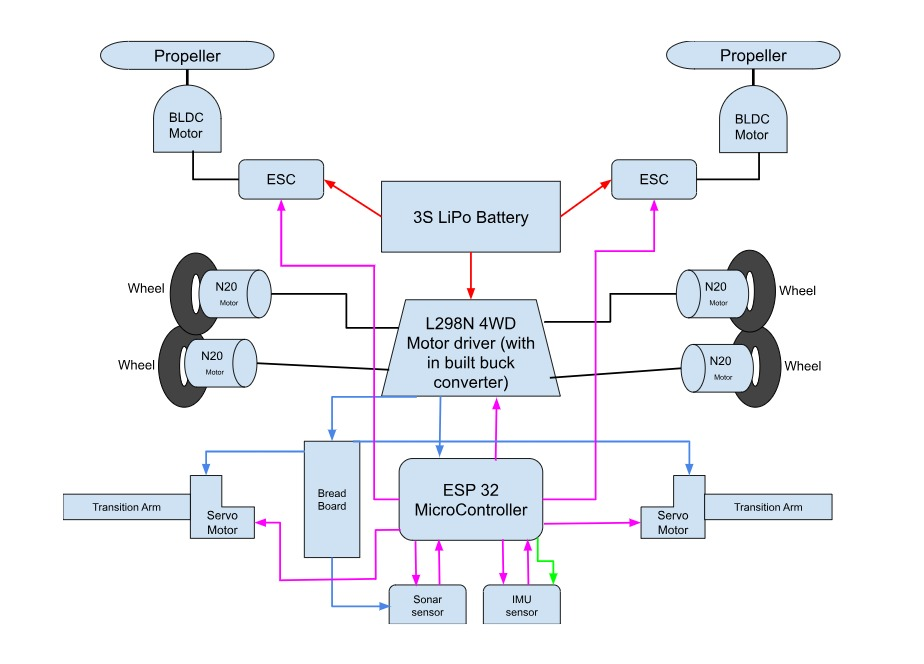
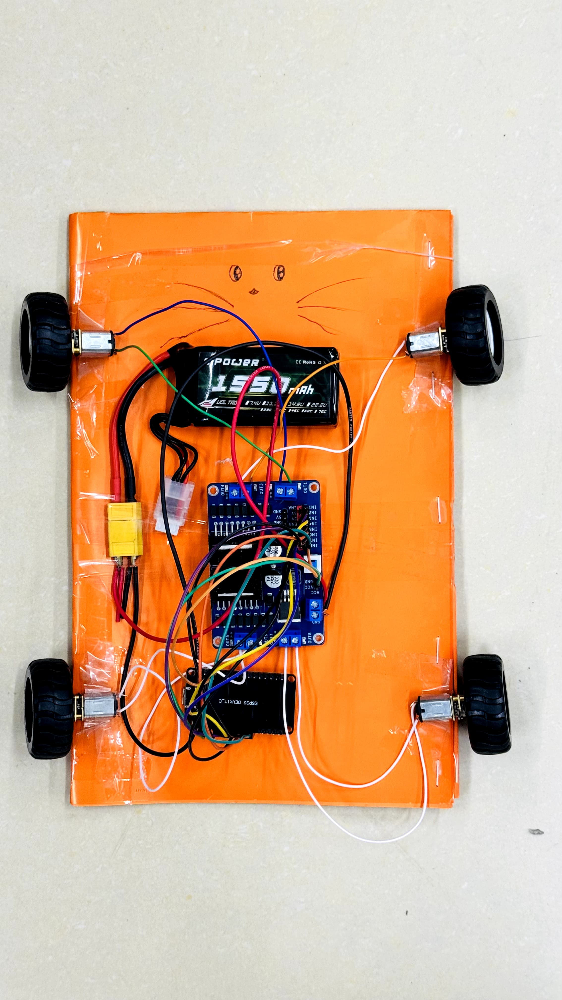

# 🧗 Autonomous Wall-Climbing Robot

**ESP32-based autonomous wall-climbing robot using BLDC aerodynamic adhesion.**

An **ESP32-based autonomous wall-climbing robot** developed as part of the **EEE 2124: Electronics** course at **United International University (UIU)**. The project explores aerodynamic adhesion, where a high-speed **BLDC motor** generates downward thrust to create sufficient normal force, enabling the robot to adhere to and climb vertical surfaces while maintaining traction through its four-wheel differential drive system.

Inspired by the research paper *[EJBot-II: An Optimized Skid-Steering Propeller-Type Climbing Robot with Transition Mechanism](https://www.researchgate.net/publication/335497260_EJBot-II_an_optimized_skid-steering_propeller-type_climbing_robot_with_transition_mechanism)*, this project integrates **embedded systems, robotics, motor control, sensor fusion, and mechanical design** to demonstrate an alternative approach to wall climbing without relying on magnets or suction cups.

Throughout the development process, the system evolved from an initial **dual-BLDC** concept into a lightweight **single-BLDC prototype** through iterative design, testing, and optimization. The final prototype successfully demonstrated controlled climbing on non-magnetic vertical surfaces, validating the feasibility of aerodynamic wall adhesion as a practical wall-climbing mechanism.

---

## 🎓 Project Information

| Category | Details |
|----------|---------|
| **Course** | EEE 2124 – Electronics |
| **Institution** | United International University (UIU) |
| **Department** | Department of Computer Science & Engineering |
| **Instructor** | Fahim Hafiz |
| **Team** | Group 2, Section G |
| **Team Name** | Mission Impassable |

## 👥 Team Members

| Name | Student ID |
|------|-----------:|
| **Faija Ahamed Mim** | 0112430171 |
| **Eusa Anjum Himel** | 0112430162 |
| **Maryum Binte Hossain** | 0112430152 |


## 🏆 Result

The final prototype successfully demonstrated **controlled vertical wall climbing** using **BLDC-generated aerodynamic adhesion** in combination with a four-wheel differential drive system. By generating high-speed downward airflow, the BLDC motor produced sufficient normal force to maintain stable contact with the wall, while the drive wheels provided the traction required for upward movement.

The robot successfully climbed **non-magnetic, non-smooth vertical surfaces**, validating the feasibility of **propeller-based aerodynamic adhesion** as an alternative to conventional wall-climbing methods such as magnets or vacuum suction. This achievement confirmed the effectiveness of the proposed design and demonstrated the successful integration of **embedded systems, motor control, sensor fusion, and mechanical engineering** into a functional robotic platform.

Although continuous climbing was limited to approximately **10 seconds** due to **BLDC motor overheating**, the project successfully proved the core concept and identified key areas for future improvement, including thermal management, weigh


# 📸 Project Gallery

## 📐 System Integration Diagram

<p align="center">
  
</p>

---

## 🛠️ Initial Prototype

<p align="center">
  
</p>

---

## 🔧 Phase 2 Development

<p align="center">
  
</p>

---

## ⚙️ Phase 3 Development

<p align="center">
  
</p>

---

## 🚀 Phase 4 Development

<p align="center">
  
</p>

---

## 🏆 Final Prototype

<p align="center">
  
</p>

---
# 🎥 Demonstration Videos

### 🧪 Prototype Test
🎬 **[Watch Video](media/1st%20vedio.mp4)**

### ⚙️ Intermediate Test
🎬 **[Watch Video](media/2nd%20vedio.mp4)**

### 🧗 Final Wall-Climbing Test
🎬 **[Watch Video](media/Mission%20Impassable%20Wall.mp4)**

---

## 🔧 Hardware Components

The robot integrates embedded electronics, sensing modules, motor control systems, and a lightweight mechanical structure to achieve reliable locomotion and aerodynamic wall adhesion.

| Component | Specification | Purpose |
|-----------|--------------|---------|
| **ESP32 DevKit** | Dual-Core Wi-Fi & Bluetooth Microcontroller | Main controller responsible for sensor processing, motor control, autonomous logic, and Bluetooth communication. |
| **4 × N20 Geared DC Motors** | 100 RPM | Provide four-wheel differential drive for ground movement and wall climbing. |
| **L298N 4WD Motor Driver** | Dual H-Bridge Driver | Controls the direction and speed of the four DC motors. |
| **A2212 BLDC Motor** | 1000KV | Generates downward aerodynamic thrust for wall adhesion. |
| **8-inch Propeller** | Two-Blade Propeller | Produces airflow to create the pressure differential required for adhesion. |
| **BLHeli-S ESC** | Electronic Speed Controller | Controls the speed of the BLDC motor. |
| **MPU6050 IMU** | 6-Axis Accelerometer & Gyroscope | Measures pitch and orientation for stable wall-climbing control. |
| **HC-SR04 Ultrasonic Sensor** | Distance Sensor | Detects obstacles during autonomous navigation. |
| **2 × Servo Motors** | MG90S / Equivalent | Used for prototype floor-to-wall transition experiments. |
| **Li-Po Battery** | 11.1–11.7 V, ~1500 mAh | Powers the robot's electronic and mechanical systems. |
| **3D-Printed Chassis** | PLA Structure | Lightweight body supporting all hardware components. |

## 💻 Software Stack

The robot's firmware was developed using embedded programming techniques to integrate sensors, motor control, Bluetooth communication, and autonomous navigation into a unified control system.

| Software / Technology | Purpose |
|-----------------------|---------|
| **Arduino IDE** | Development environment for programming and uploading ESP32 firmware. |
| **C++ (Arduino Framework)** | Primary programming language used for embedded system development. |
| **ESP32 Arduino Core** | Enables programming support for the ESP32 development board. |
| **Wire (I²C) Library** | Handles communication with I²C-based sensors such as the MPU6050. |
| **MPU6050 Library** | Reads accelerometer and gyroscope data for pitch estimation. |
| **ESP32Servo Library** | Controls servo motors during transition mechanism experiments. |
| **Bluetooth Serial Library** | Enables wireless manual control via smartphone or Bluetooth controller. |
| **PWM (ESC Control)** | Controls BLDC motor speed through the Electronic Speed Controller. |
| **Git & GitHub** | Version control, documentation, and project management. |

## ⚙️ How It Works

The robot combines **embedded systems**, **sensor-based control**, and **aerodynamic adhesion** to achieve controlled wall climbing. Each subsystem performs a specific function, enabling the robot to navigate, detect its orientation, and maintain adhesion while climbing.

### 🚗 Locomotion
The robot uses **four N20 geared DC motors** arranged in a four-wheel differential drive configuration. The motors are controlled through an **L298N 4WD motor driver**, providing stable movement on both horizontal and vertical surfaces.

### 🌪️ Aerodynamic Adhesion
Wall adhesion is achieved using a centrally mounted **A2212 1000KV BLDC motor** fitted with a downward-facing propeller and driven by a **BLHeli-S Electronic Speed Controller (ESC)**. The airflow generated by the propeller passes through ventilation openings in the chassis, creating a pressure differential that presses the robot firmly against the wall. This aerodynamic force provides the normal force required for the drive wheels to maintain traction during climbing.

### 📐 Orientation & Stability
An **MPU6050 Inertial Measurement Unit (IMU)** continuously monitors the robot's pitch angle. Based on the measured orientation, the ESP32 determines when to activate the BLDC motor and dynamically adjusts the wheel-driving strategy as the robot transitions from horizontal movement to vertical climbing, improving stability and traction.

### 📡 Obstacle Detection
An **HC-SR04 ultrasonic sensor** is used during autonomous operation to detect nearby obstacles. The sensor enables the robot to identify obstacles and execute predefined avoidance maneuvers before continuing its navigation.

### 🧠 Control System
The entire robotic platform is controlled by an **ESP32 microcontroller**, which integrates sensor data, executes the control algorithms, manages motor and ESC operation, and provides **Bluetooth communication** for manual control via a smartphone or Bluetooth controller.

> **Note:** A complete hardware list, GPIO pin mapping, wiring diagram, and component selection rationale are provided in the **Project Proposal** and **System Integration Diagram** located in the `docs/` directory.

---

## 🔄 Design Evolution

The project originally proposed a **dual-BLDC propulsion system**, **rubber tracks**, and a **servo-assisted floor-to-wall transition mechanism** to achieve fully autonomous wall climbing. During development, extensive prototyping and testing showed that the design could be simplified while still validating the primary engineering objective.

The final prototype was redesigned as a lightweight **single-BLDC system** mounted on a compact **3D-printed chassis (approximately 25–28 cm)** with a four-wheel differential drive. Although several advanced features from the initial proposal were omitted, this iterative redesign significantly improved reliability, reduced mechanical complexity, and successfully demonstrated the feasibility of **aerodynamic wall adhesion**. The design evolution reflects a fundamental engineering principle: simplifying a system to achieve a robust, functional prototype before introducing additional complexity.

## 📂 Repository Structure

```text
Autonomous-Wall-Climbing-Robot/
│
├── README.md                         # Project documentation
├── code/                             # ESP32 firmware source code
│   ├── v1_manual_bluetooth_ultrasonic/
│   ├── v2_servo_lift/
│   ├── v3_soft_curves/
│   ├── v4_mpu_tilt_draft/
│   ├── v5_tilt_and_obstacle_avoidance/
│   ├── v6_auto_v2_mode/
│   ├── v7_bldc_auto_thrust/
│   └── v8_final_bldc_pitch_control/
│
├── docs/                             # Project documents
│   ├── Project_Proposal.pdf
│   ├── System_Integration_Diagram.pdf
│   ├── Circuit_Diagram.pdf
│   └── Final_Report.pdf
│
├── media/                            # Images and demonstration videos
│   ├── SID.jpeg
│   ├── beginning.jpeg
│   ├── 2nd phase.jpeg
│   ├── 3rd phase.jpeg
│   ├── 4th phase.jpeg
│   ├── Final Implimentation.jpeg
│   ├── 1st vedio.mp4
│   ├── 2nd vedio.mp4
│   └── Mission Impassable Wall.mp4
│
└── LICENSE
```

## 📝 Firmware Evolution

The firmware was developed incrementally through multiple iterations, with each version introducing new functionality, improving system reliability, and addressing issues identified during hardware testing.

| Version | Description |
|----------|-------------|
| **v1** | Implemented Bluetooth-based manual control and ultrasonic obstacle detection. |
| **v2** | Added a dual-servo lift mechanism for the proposed floor-to-wall transition system. |
| **v3** | Improved maneuverability through smooth differential ("soft curve") turning. |
| **v4** | Integrated the MPU6050 IMU for real-time pitch sensing and orientation monitoring. |
| **v5** | Refined tilt-based motor control, corrected initialization issues, and enhanced autonomous obstacle avoidance. |
| **v6** | Developed Auto V2 mode with obstacle-triggered climbing logic and pitch-based wheel control. |
| **v7** | Integrated the BLDC motor and ESC, enabling pitch-controlled aerodynamic adhesion. |
| **v8 (Final)** | Optimized BLDC activation, improved control responsiveness, and finalized the wall-climbing algorithm used during the final demonstration. |


## 🚧 Engineering Challenges

Throughout the project, several engineering challenges were encountered and addressed through iterative design, testing, and debugging.

- Achieving sufficient aerodynamic adhesion for stable wall climbing.
- Balancing the thrust-to-weight ratio while maintaining structural integrity.
- Calibrating the BLDC motor and ESC for consistent thrust generation.
- Integrating multiple sensors and actuators without GPIO conflicts.
- Ensuring reliable pitch estimation using the MPU6050 IMU.
- Optimizing traction during the transition from horizontal to vertical movement.
- Managing power distribution between the drive motors, BLDC motor, sensors, and controller.
- Minimizing BLDC motor overheating during extended climbing.
- Debugging hardware and firmware integration to improve overall system stability.


## 🚀 Future Improvements

Several enhancements have been identified to further improve the robot's performance, reliability, and autonomy.

- Improve BLDC thermal management for longer climbing duration.
- Reduce overall chassis weight to increase the thrust-to-weight ratio.
- Design an optimized aerodynamic duct to improve adhesion efficiency.
- Reintroduce the dual-BLDC propulsion system proposed in the original design.
- Implement a fully autonomous floor-to-wall transition mechanism.
- Integrate computer vision for autonomous navigation and obstacle recognition.
- Replace the L298N with a higher-efficiency motor driver.
- Implement closed-loop PID control for smoother motion and improved stability.
- Optimize power management to increase battery life.


##  Acknowledgements

This project was developed as part of the **EEE 2124: Electronics** course at **United International University (UIU)** under the supervision of **Fahim Hafiz**. We sincerely appreciate the guidance provided throughout the project and acknowledge the inspiration drawn from the **EJBot-II** research paper, which served as the foundation for the aerodynamic wall-climbing concept.
